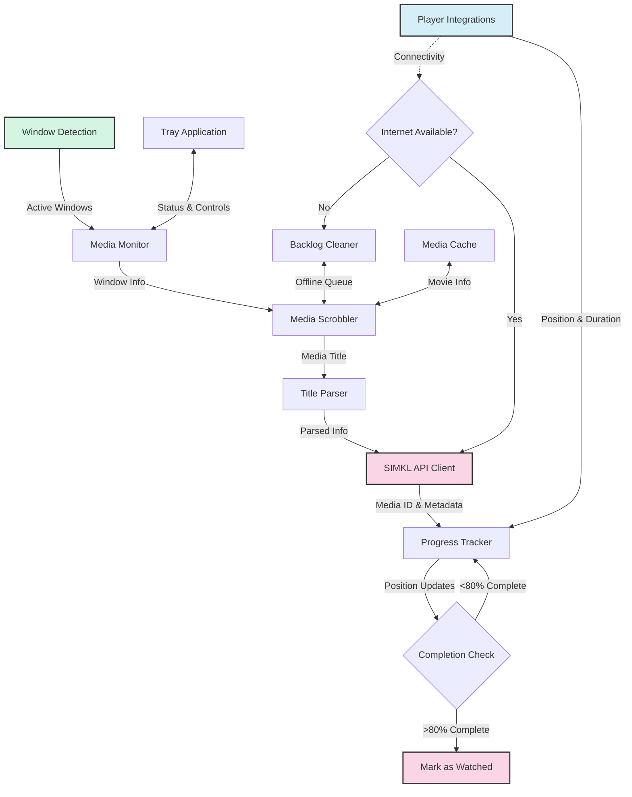

# ⚙️ Advanced & Developer Guide

This guide combines advanced configuration and developer documentation for MPS for SIMKL.

## 🛠️ Advanced Configuration

Settings can be customized via config files, environment variables, or command-line options. See the [Media Players Guide](media-players.md) for player-specific settings.


### Config File Locations

Use the tray menu for the most reliable path on any OS:

- `Maintenance → Open Data Folder`

Typical locations:

| Platform | Typical Data Location |
|----------|------------------------|
| Windows  | `%USERPROFILE%\kavin\simkl-mps\` |
| macOS    | `~/kavin/simkl-mps/` |
| Linux    | `~/.local/share/kavin/simkl-mps/` |

If you are upgrading from older versions, migration handles older paths automatically.

### Example Settings

```ini
# .simkl_mps.env
SIMKL_ACCESS_TOKEN=your_access_token_here
USER_ID=your_user_id
```

### Directory Whitelisting / Blacklisting

Directory filters live in `settings.json` inside your app data folder. You can allow only specific folders and/or exclude folders you never want tracked.

You can edit these lists from the tray menu: **Maintenance → Directory Filters**.

**Rules (Deny rules override allow rules):**
- If `allow_dirs` is empty, all paths are allowed by default.
- If `allow_dirs` has entries, only those paths are allowed by default.
- After allow rules are evaluated, `deny_dirs` rules are applied and can override them.

**Glob patterns are supported.** Examples: `D:\\Media\\**\\Anime\\*`, `~/Videos/**/*.mkv`.

Example `settings.json`:

```json
{
  "watch_completion_threshold": 80,
  "auto_sync_interval": 120,
  "allow_dirs": [
    "D:\\Media\\Movies",
    "D:\\Media\\Shows"
  ],
  "deny_dirs": [
    "D:\\Media\\Movies\\Kids"
  ]
}
```

See [Media Players Guide](media-players.md) for player-specific environment variables.

---

## 👩‍💻 Developer Guide

### Project Structure

```
Media-Player-Scrobbler-for-Simkl/
  docs/                # Documentation
  simkl_mps/           # Main package
    players/           # Media player integrations
    utils/             # Utility functions
  pyproject.toml       # Project metadata
  README.md            # Project overview
  LICENSE              # License info
```

### Setup & Environment

```bash
git clone https://github.com/ByteTrix/media-player-scrobbler-for-simkl.git
cd Media-Player-Scrobbler-for-Simkl
poetry install --with dev
# or
pip install -e ".[dev]"
```

### Adding a New Media Player

1. Create a new file in `players/` (e.g. `simkl_mps/players/new_player.py`)
2. Implement a class with a `get_position_duration()` method
3. Add the player to `players/__init__.py`
4. Update detection in `window_detection.py`

### Building & Publishing

```bash
poetry build
poetry publish
```

### Architecture Overview



---

For more, see the [Usage Guide](usage.md) and [Media Players Guide](media-players.md).

