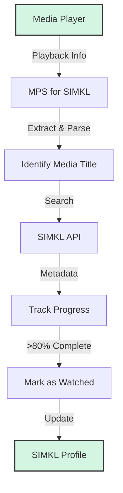

# 🎬 MPS for SIMKL

## What is MPS for SIMKL?

MPS for SIMKL (Media Player Scrobbler) is a cross-platform app that tracks what you watch in supported media players and syncs progress to SIMKL. It supports movies, TV shows, and anime. It runs in the background/tray and works on Windows, Linux, and macOS (experimental).

## ⚡ Quick Start

- **Windows:** Use the [Windows Guide](windows-guide.md) (EXE installer, tray app, no commands needed).
- **Linux:** Use the [Linux Guide](linux-guide.md) (pipx recommended, tray app, setup command needed).
- **macOS:** Use the [macOS Guide](mac-guide.md) (pip install, tray app, setup command needed, experimental).

After installation, authenticate with SIMKL and **configure your media players** using the [Media Players Guide](media-players.md) (this step is critical for accurate tracking).

## 📚 Documentation

- [Windows Guide](windows-guide.md)
- [Linux Guide](linux-guide.md)
- [macOS Guide](mac-guide.md)
- [Supported Media Players](media-players.md)
- [Usage Guide](usage.md)
- [Local Watch History](watch-history.md)
- [Advanced & Developer Guide](configuration.md)
- [Troubleshooting Guide](troubleshooting.md)
- [Todo List](todo.md)

## 🔍 How It Works

1. **Detection:** Monitors media players via window titles or player APIs.
2. **Identification:** Extracts and matches media titles against SIMKL.
3. **Tracking:** Monitors playback position (requires player configuration via [Media Players Guide](media-players.md)).
4. **Completion:** Marks as watched when the configured threshold (default 80%) is reached.
5. **Sync:** Updates your SIMKL profile automatically.

## 📝 License

MPS for SIMKL is licensed under the GNU GPL v3 License. See the [LICENSE](https://github.com/ByteTrix/Media-Player-Scrobbler-for-Simkl/blob/main/LICENSE) file for details.

---

  
Made with ❤️ by <a href="https://github.com/itskavin">kavin</a>

  

    <a href="https://github.com/ByteTrix/Media-Player-Scrobbler-for-Simkl/stargazers">⭐ Star us on GitHub</a> •
    <a href="https://github.com/ByteTrix/Media-Player-Scrobbler-for-Simkl/issues">🐞 Report Bug</a> •
    <a href="https://github.com/ByteTrix/Media-Player-Scrobbler-for-Simkl/issues">✨ Request Feature</a>
  

