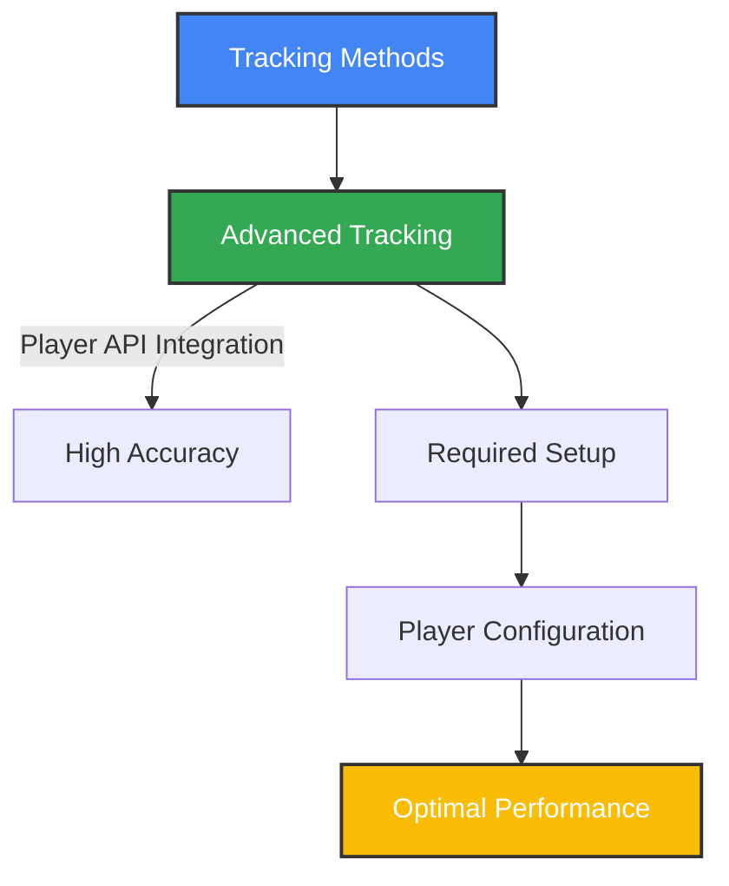
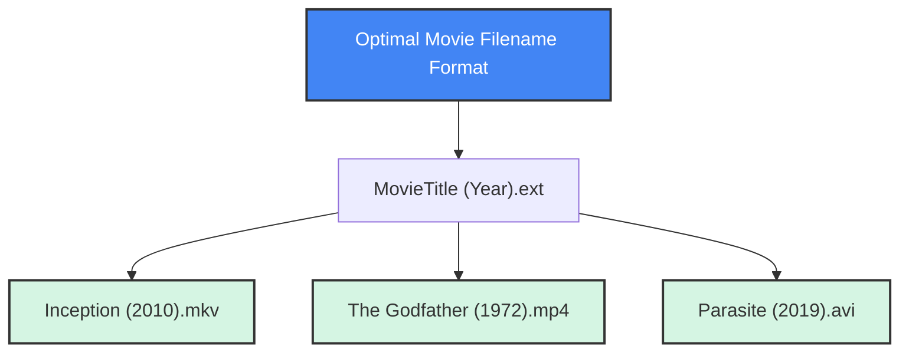

# 🎥 Supported Media Players

This guide shows supported media players and the simple setup needed for accurate tracking.

## ⚠️ Important: Media Player Configuration

**Media player configuration is critical for accurate tracking.** Basic window-title detection works, but player integration is much more reliable.



Follow the platform-specific instructions below to set up your preferred media player for the best tracking experience.

## 🗂️ Compatibility Matrix

| Player                | Windows | macOS | Linux | Advanced Tracking | Configuration Difficulty |
|-----------------------|:-------:|:-----:|:-----:|:----------------:|:----------------------:|
| VLC                   | ✅      | ✅    | ✅    | ✅              | Easy                   |
| MPV                   | ✅      | ✅    | ✅    | ✅              | Easy                   |
| MPC-HC/BE             | ✅      | ❌    | ❌    | ✅              | Easy                   |
| MPC-QT                | ✅      | ❌    | ✅    | ✅              | Easy                   |
| PotPlayer             | ✅      | ❌    | ❌    | ✅              | None (Auto-detected)   |
| MPV Wrappers*         | ✅      | ✅    | ✅    | ✅              | Moderate               |

*MPV Wrappers: Celluloid, MPV.net, SMPlayer, IINA, Haruna, etc.

> **Note**: For **advanced tracking** with accurate playback position and duration, you must use one of the supported players (VLC, MPC-HC/BE) with proper configuration.

---

## 🪟 Windows Media Player Configuration

### VLC Media Player (Recommended)

**Step-by-Step Configuration:**
1. Open VLC Media Player
2. Navigate to **Tools → Preferences**
3. At the bottom left, change **Show settings** to **All**
4. Navigate to **Interface → Main interfaces**
5. Check the box for **Web** to enable the web interface
6. Go to **Interface → Main interfaces → Lua**
7. Set "simkl" as a password in the **Lua HTTP Password** field
8. Optional: Change the port number (default is 8080)
9. Click **Save** and restart VLC
10. Visit http://localhost:8080/
11. Enter Your Password (hint: simkl) 

> Optional visual walkthrough: [Enable VLC Web Interface](https://github.com/azrafe7/vlc4youtube/blob/55946aaea09375cfa4dc0dbae0428ad13eb9e046/instructions/how-to-enable-vlc-web-interface.md)

**Verification:**
- The scrobbler will automatically connect to VLC on port 8080 (or your custom port)
- Play media in VLC to test. You should see accurate position tracking.

### MPV Media Player

**Windows Configuration:**
1. Locate or create the MPV configuration directory:
   - Press `Win+R` and enter `%APPDATA%` to open the Roaming folder
   Or
   - Navigate to `%APPDATA%\mpv\` (create it if it doesn't exist)
3. Create or edit `mpv.conf` file
4. Add the following lines:
   ```
   # Enable IPC socket for advanced tracking
   input-ipc-server=\\.\pipe\mpvsocket
   ```
5. Save the file and restart MPV

**Verification:**
- Play media in MPV
- The scrobbler will connect to the pipe socket
- Position data should be accurately tracked

### MPV Wrapper Players (MPV.net, SMPlayer, etc.)

**Windows Configuration:**
1. Most MPV wrapper players use the same MPV backend configuration:
   - For **MPV.net**: Configure in `%APPDATA%\mpv.net\mpv.conf`
   - For **Haruna Player**: Configure in `%APPDATA%\haruna\mpv.conf`
   - For **Celluloid**: Configure in `%APPDATA%\celluloid\mpv.conf`

2. Add the following line to the appropriate configuration file:
   ```
   # Enable IPC socket for advanced tracking
   input-ipc-server=\\.\pipe\mpvsocket
   ```

3. Save the file and restart the player

**Verification:**
- Play media in your MPV wrapper player
- The scrobbler should connect and show accurate position data

### PotPlayer (Recommended - Zero Configuration)

**PotPlayer** is a Windows media player that provides excellent integration with zero configuration required. The scrobbler automatically detects and connects to PotPlayer using Windows messaging API.

**How it Works:**
- Uses Windows messaging API for direct communication with PotPlayer
- Automatically caches the current filename when detected
- Filters out UI states like "Chapter 16", "Show main menu", etc.
- Cleans filename by removing "(With subtitles)" and similar appendages
- Provides accurate position/duration data in real-time

**Supported Versions:**
- PotPlayer 32-bit and 64-bit (PotPlayerMini64.exe recommended)
- All recent versions with standard Windows messaging support

**Verification:**
- Play media in PotPlayer
- The scrobbler automatically connects (no web interface needed)
- You should see accurate position tracking and media detection
- Check logs for "Successfully connected to PotPlayer via Windows messaging"

### MPC-HC/BE (Media Player Classic)

**Step-by-Step Configuration:**
1. Open MPC-HC or MPC-BE
2. Navigate to **View → Options**
3. Go to **Player → Web Interface**
4. Check **Listen on port:** and ensure it's set to **13579** (default)
5. Click **OK** and restart MPC

**Verification:**
- Play media in MPC
- The scrobbler will connect to the web interface
- Position data should be accurately tracked

### MPC-QT (Media Player Classic Qute Theater)

**Step-by-Step Configuration:**
1. Open MPC-QT
2. Navigate to **View → Options**
3. Go to **Player → Web Interface**
4. Check **Enable web server**
5. Ensure port is set to **13579** (default)
6. Uncheck the **Allow Access From Localhost Only**
7. Click **OK** and restart MPC-QT

**Verification:**
- Play media in MPC-QT
- The scrobbler will connect to the web interface
- Position data should be accurately tracked

### SMPlayer (MPV-based)

SMPlayer is a versatile media player that can use MPV as its backend.

**Configuration Steps:**
1. Open SMPlayer
2. Go to **Options → Preferences**
3. Click on **Advanced** in the left sidebar
4. Select the **MPlayer/MPV** tab
5. In the **Options:** field, add: 
   ```
   --input-ipc-server=\\.\pipe\mpvsocket
   ```
   (for Windows) or
   ```
   --input-ipc-server=/tmp/mpvsocket
   ```
   (for Linux/macOS)
6. Click **OK** and restart SMPlayer

**Verification:**
- Play media in SMPlayer
- The scrobbler should connect to the MPV backend
- Position data should be accurately tracked

### Syncplay (with MPV)

Syncplay allows synchronized playback across multiple users and can use MPV as its player.

**Configuration Steps:**
1. Open Syncplay
2. In the configuration dialog, set **Media Player** to **mpv**
3. In the **Player arguments:** field, add:
   ```
   --input-ipc-server=\\.\pipe\mpvsocket
   ```
   (for Windows) or
   ```
   --input-ipc-server=/tmp/mpvsocket
   ```
   (for Linux/macOS)
4. Click **Save** and restart Syncplay

**Verification:**
- Start a Syncplay session and play media
- The scrobbler should connect to the MPV backend
- Position data should be accurately tracked

---

## 🍏 macOS Media Player Configuration

### VLC Media Player

Follow the same configuration steps as shown in the Windows VLC section above.

### MPV Media Player

1. Create or locate the MPV configuration directory:
   - `~/.config/mpv/` (create it if it doesn't exist)
2. Create or edit `mpv.conf`
3. Add the following line:
   ```
   # Enable IPC socket for advanced tracking
   input-ipc-server=/tmp/mpvsocket
   ```
4. Save and restart MPV

### MPV Wrapper Players (IINA, etc.)

**macOS Configuration:**
1. For **IINA**: 
   - IINA uses MPV as its backend
   - Configure in `~/.config/mpv/mpv.conf` or 
   - Configure in `~/Library/Application Support/io.iina.iina/mpv.conf`
   
2. Add the following line to the appropriate configuration file:
   ```
   # Enable IPC socket for advanced tracking
   input-ipc-server=/tmp/mpvsocket
   ```

3. Save the file and restart IINA

**Verification:**
- Play media in your MPV wrapper player
- The scrobbler should connect and show accurate position data

### QuickTime

Basic window title tracking only. No advanced integration available.

---

## 🐧 Linux Media Player Configuration

### VLC Media Player

Follow the same configuration steps as shown in the Windows VLC section above.

### MPV Media Player

1. Create or locate the MPV configuration directory:
   - `~/.config/mpv/` (create it if it doesn't exist)
2. Create or edit `mpv.conf`
3. Add the following line:
   ```
   # Enable IPC socket for advanced tracking
   input-ipc-server=/tmp/mpvsocket
   ```
4. Ensure the socket path has appropriate permissions
5. Save and restart MPV

### MPV Wrapper Players (Celluloid, SMPlayer, etc.)

**Linux Configuration:**
1. Configure the appropriate MPV config file:
   - For **Celluloid**: Configure in `~/.config/mpv/mpv.conf`
   - For **Haruna Player**: Configure in `~/.config/haruna/mpv.conf`

   
2. Add the following line to the appropriate configuration file:
   ```
   # Enable IPC socket for advanced tracking
   input-ipc-server=/tmp/mpvsocket
   ```

3. Save the file and restart the player

**For Celluloid (GNOME MPV):**
1. Edit the MPV config as above
2. In Celluloid, go to Preferences > MPV Configuration
3. Add: `input-ipc-server=/tmp/mpvsocket`
4. Restart Celluloid

---

## 🧠 Tracking Methods Explained


### Advanced Tracking
With advanced tracking (properly configured players):
- Exact playback position is known
- Precise tracking of watch progress
- Accurate determination of completion
- Better handling of pauses and skips


---

## 🏷️ Filename Best Practices

For optimal media identification, follow these naming conventions:



**Recommended Format:** `MovieTitle (Year).extension`

**Examples:**
- `Inception (2010).mkv`
- `The Shawshank Redemption (1994).mp4`
- `Pulp Fiction (1994).avi`

**Additional Tips:**
- Include the year for better identification
- Avoid extra text like quality info or release group names in main filename
- Remove unnecessary punctuation


---

## 🛠️ Troubleshooting Player Configuration

| Issue | Possible Cause | Solution |
|-------|----------------|----------|
| VLC connection fails | Web interface not enabled | Enable web interface in VLC settings |
| | Wrong password | Check the password in VLC Lua HTTP settings |
| | Port conflict | Change the port in VLC settings |
| MPV socket error | Incorrect socket path | Verify the path in mpv.conf matches expectations |
| | Permission issues | Check file permissions on the socket |
| MPC-HC not detected | Web interface disabled | Enable web interface in MPC options |
| | Wrong port | Verify port is set to 13579 |
| General tracking issues | Filename format | Ensure movie files follow naming best practices |

### Testing Player Configuration

1. Configure your media player according to the instructions
2. Start Media Player Scrobbler for SIMKL with debug logging:
   ```bash
   simkl-mps tray --debug
   ```
3. Play media in your configured player
4. Check the logs for connection messages and position data
5. If successful, position data should appear in the logs

---

## 📊 Player Comparison

| Feature | VLC | MPV | MPC-HC/BE | PotPlayer |
|---------|-----|-----|-----------|-----------|
| Ease of configuration | ★★★★☆ | ★★☆☆☆ | ★★★★☆ | ★★★★★ |
| Cross-platform | ✅ | ✅ | ❌ | ❌ |
| Position accuracy | Very High | High | Very High | Very High |
| Resource usage | Moderate | Low | Low | Low |
| Configuration required | Yes | Yes | Yes | None |
| Recommended for | Beginners | Power users | Windows users | Windows users |

**Recommendations by use case:**
- **Zero configuration needed**: **PotPlayer** (Windows only) - works immediately out of the box
- **Cross-platform compatibility**: **VLC** - most universal option with reliable tracking
- **Advanced features & customization**: **MPV** - for power users who want maximum control
- **Windows-specific with web interface**: **MPC-HC/BE** - traditional Windows media player experience
