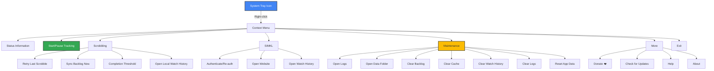

# 🪟 Windows Installation & Configuration Guide

This guide covers install, setup, and daily usage for Windows users.

## 📥 Windows Installer

The Windows installer provides the most streamlined experience with automatic updates and system integration.

### Download and Installation Process

1. [Download the latest installer](https://github.com/ByteTrix/Media-Player-Scrobbler-for-Simkl/releases/latest)
2. **Right-click** the installer and select **"Run as administrator"** (recommended)
3. Follow the setup wizard:
   - Accept the license agreement
   - Choose your preferred installation location (optional)
   - Select components to install:
     - Desktop shortcut
     - Start menu shortcuts
     - **Auto-start on login** (recommended)
     - **Auto-update checking** (recommended)

### Installer Features

- **All-in-one package**: Includes all dependencies (no separate Python installation required)
- **System integration**: Creates desktop and start menu shortcuts
- **Auto-start capability**: Option to run automatically when Windows starts
- **Auto-update system**: Checks for updates weekly
- **Clean uninstallation**: Properly removes all components

### Silent & Automated Deployment

- The installer now honors common enterprise parameters: use `/quiet`, `/silent`, `/s`, `/qn`, or `/passive` when automating deployments
- Each alias maps internally to Inno Setup's `/VERYSILENT /SUPPRESSMSGBOXES /NORESTART` flags, ensuring the Microsoft Store silent install check succeeds
- Combine additional switches such as `/LOG="C:\\temp\\mpss-install.log"` as needed; they will be preserved when silent aliases are used
- When running interactively, the traditional `/SILENT` or `/VERYSILENT` options continue to function unchanged

### Post-Installation

After installation completes:
1. The application launches automatically
2. Authenticate with your SIMKL account when prompted
3. A system tray icon appears in the notification area
4. **CRITICAL STEP**: Configure your media players for optimal tracking (see below)

## ⚙️ Media Player Configuration on Windows (recommended)

For the best tracking experience, configure your preferred media players:
[Media Players](media-players.md)

## 🖥️ Windows System Integration

### System Tray Features

Right-click the system tray icon to access:

- **Status information**: Current monitoring state and connection status
- **Start/Pause Tracking**: Pause or resume tracking on demand
- **Scrobbling**: Recovery and threshold controls
  - **Retry Last Scrobble**: Clears cache for the active file and attempts to re-identify and scrobble it. Use when the wrong title/episode appears.
  - **Sync Backlog Now**: Immediately processes any offline scrobbles waiting in backlog.
  - **Completion Threshold**: Quickly switch between preset watch thresholds (65%, 80%, 90%) or define a custom percentage.
  - **Open Local Watch History**: Open the local watch history viewer in your web browser.
- **SIMKL**: Account and service management
  - **Authenticate / Re-authenticate**: Launch the SIMKL login flow if you are signing in for the first time or need to refresh an expired token.
  - **Open Website**: Visit the SIMKL website.
  - **Open Watch History**: View your watch history on SIMKL.
- **Maintenance**: Logs, data, and cache management
  - **Open Logs**: Jump straight to app diagnostics from the tray.
  - **Open Data Folder**: Open the application data directory.
  - **Clear Backlog**: Deletes pending offline scrobbles to stop repeated sync prompts.
  - **Clear Cache**: Removes local media cache data while keeping logs and settings intact.
  - **Clear Watch History**: Removes the local `watch_history.json` file and viewer data without touching your SIMKL account.
  - **Clear Logs**: Truncates application and playback logs so you can capture a fresh session before debugging.
  - **Reset App Data (Danger)**: Performs a full reset—use only when you want a clean re-authentication; the app exits afterward.
- **More**: Additional utilities
  - **Donate ❤️**: Support the project.
  - **Check for Updates**: Check if a newer version is available.
  - **Help**: Open help documentation.
  - **About**: View application information.
- **Exit**: Close the application

### Windows Auto-Start

If you selected auto-start during installation, the app launches when you sign in.

To change startup behavior later:

1. Open **Task Manager → Startup apps** (or **Settings → Apps → Startup**)
2. Enable or disable **MPS for SIMKL**

### Windows-Specific File Locations

- **Configuration file**: `%%USERPROFILE%\kavin\simkl-mps\.simkl_mps.env`
- **Log files**: `%USERPROFILE%\kavin\simkl-mps\simkl_mps.log`
- **Backlog**: `%USERPROFILE%\kavin\simkl-mps\backlog.json`

## 🔄 Windows Update System

The Windows installer version includes an automatic update system:

### How Updates Work

1. If auto-check is enabled, the application checks for updates weekly
2. When an update is available, a notification appears
3. Click the update option in the tray menu
4. Your default browser opens and the update downloads automatically
5. Install the Setup
6. The application restarts with the new version

## 🚀 Optimizing for Windows

### Performance Tips

1. **Use the Windows installer** for the best experience
2. Enable **auto-start** for convenience
3. Configure **VLC** or **MCP-HC** for the most accurate tracking
4. Use the **system tray menu** for quick access to functions
5. **Proper filenames** significantly improve media identification:
   - Best format: `Movie Title (Year).extension`
   - Example: `Inception (2010).mkv`

## 🔍 Windows Troubleshooting

### Common Issues

| Issue | Solution |
|-------|----------|
| Installation fails | Run as administrator, check Windows Defender settings |
| Application doesn't start | Check Event Viewer for errors, verify .NET Framework installation |
| Tray icon missing | Check if app is running in Task Manager, restart app |
| VLC connection fails | Verify web interface is enabled and password is correct |
| MPV not detected | Check if socket path in config matches expectations |
| Movie not identified | Use clearer filename, check log for details |

### Checking Logs on Windows

1. Right-click the system tray icon
2. Select **Maintenance → Open Logs**
3. The log file opens in your default text editor

### Running with Debug Logging

For advanced troubleshooting:
1. Open Command Prompt or PowerShell
2. Navigate to the installation directory
3. Run: `simkl-mps tray --debug`

## 📲 Uninstallation

To remove the application from your Windows system:

1. Open **Settings → Apps → Apps & features**
2. Find "MPS for SIMKL"
3. Click **Uninstall**
4. Follow the uninstallation wizard
5. Choose whether to remove user data (settings, logs, backlog) ("No" is Recommended)

## 🔔 Final Checklist for Windows Users

1. ✅ Install using the Windows installer
2. ✅ Enable auto-start for convenience
3. ✅ Configure your media players (critical step!)
4. ✅ Use clear filenames for your media
5. ✅ Play media and verify it is detected and tracked
6. ✅ Check your SIMKL profile to confirm progress is synced
